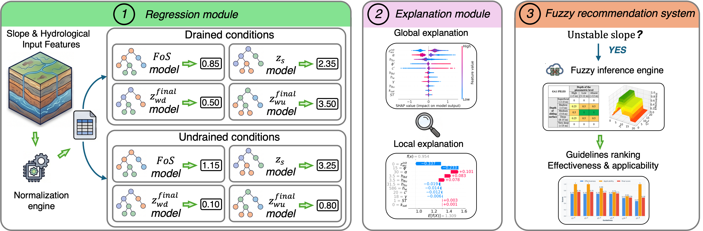

## Overview

<p align="center">
  
</p>

This project implements a machine learning workflow to evaluate the response of slopes to rainfall under drained and undrained conditions, providing a complete pipeline from data preprocessing, model training to inference.


## Repository structure

- **`dataset/`** contains drained and undrained slope simulations and the real
  cases used for external inference. See [`dataset/README.md`](dataset/README.md).
- **`src/`** contains the preprocessing, training, evaluation, explainability,
  and fuzzy-inference scripts. See [`src/README.md`](src/README.md).

Models and csv files are saved to `results/`; figures are saved to `fig/`.


## Environment

| Package | Version |
|---------|------------------|
| Python | 3.10.19 |
| NumPy | >= 1.26 |
| pandas | >= 2.1 |
| scikit-learn | >= 1.4 |
| XGBoost | >= 2.0 |
| LightGBM | >= 4.6.0 |
| SHAP | >= 0.45 |
| scikit-fuzzy | >= 0.4.2 |
| Matplotlib | >= 3.8 |
| seaborn | >= 0.13 |
| SciPy | >= 1.11 |

Recommended minimal installation:

```bash
conda create -n env python=3.10
conda activate env
pip install numpy pandas scipy scikit-learn joblib xgboost lightgbm
pip install shap matplotlib seaborn pillow statsmodels scikit-fuzzy
```


## Dataset
The dataset folder contains `D.1`, `D.2`, and `U` datasets.

```text
dataset/
|-- D.1_drained.csv # Dataset of drained cases D.1
|-- D.2_drained.csv # Dataset of drained cases D.2
|-- U_undrained.csv # Dataset of undrained cases U
```


## Data preprocessing
```bash
python src/s1_preprocessing.py
```
- `s1_preprocessing.py`: generates the training and test partitions in `dataset/train/` and `dataset/test/`.
<!-- 
The script performs the following operations:
  - **Concatenation**: Merges the intermediate drained datasets into a unified dataset (`D_drained.csv`), retaining only the features that are common across all intermediate files.
  - **Target-Specific Split**: Creates isolated datasets for distinct targets (e.g., removing zero-value initial water tables for specific datasets) and splits them into an 80% training set and a 20% testing set (`TEST_SIZE = 0.20`).

```text
dataset/
|-- ...
|-- train/
|   |-- <condition>_fos.csv
|   |-- <condition>_zwu.csv
|   |-- <condition>_zwd.csv
|-- test/
    |-- <condition>_fos.csv
    |-- <condition>_zwu.csv
    |-- <condition>_zwd.csv
```
`<condition>` is `drained` or `undrained`.

- The `fos` datasets contain the samples used for model development to predict the **Factor of Safety** (`FoS`) and the **depth of the slip surface** ($`z_s`$) under drained and undrained conditions;
- The `zwu`$ contain the samples used for model development to predict the **final upstream position of the water table** ($`z_{wu}^{\mathrm{final}}`$) under drained and undrained conditions, respectively.
* Samples with an initial upstream position of the water table equal to zero ($`z_{wu}^{\mathrm{init}} = 0`$) are removed during preprocessing.
- The `zwd` contain the samples used for model development to predict the **final upstream position of the water table** ($`z_{wd}^{\mathrm{final}}`$) under drained and undrained conditions, respectively.
* Samples with an initial upstream position of the water table equal to zero ($`z_{wd}^{\mathrm{init}} = 0`$) are removed during preprocessing.
 -->

## Train and evaluate models

```bash
python src/s2_feature_selection.py
python src/s3_hyperparam_opt.py
python src/s4_boxplot.py
python src/s5_regplot.py
```
- `s2_feature_selection.py`: performs feature selection for each target variable and condition.
- `s3_hyperparam_opt.py`: optimizes the model hyperparameters and trains the final regression models.
- `s4_boxplot.py`: compares model performance through boxplots and statistical tests.
- `s5_regplot.py`: generates regression plots comparing predicted and true values.


## Explain model predictions

```bash
python src/s6_shap_test.py
python src/s7_shap_inference.py
```
- `s6_shap_test.py`: computes SHAP explanations on the test set and generates global beeswarm plots and local waterfall plots.
- `s7_shap_inference.py`: computes SHAP explanations for the cases in `dataset/real_cases.csv` and generates the corresponding waterfall plots.


## Run the fuzzy assessment

```bash
python src/s8_fis.py
```
- `src/s8_fis.py`: uses the model predictions as inputs to the fuzzy inference system to assess and rank the available mitigation guidelines. It also generates plots of the crisp and fuzzy response surfaces, together with the final ranking of the mitigation strategies.


## Outputs

- `dataset/train/` and `dataset/test/`: train and test set resulted from `s1_preprocessing.py`;
- `results/`: `.csv` and `.pkl` file resulted from `s2_feature_selection.py` and `s3_hyperparam_opt.py`;
- `fig/`: evaluation, explanation and inference figures resulted from `s4_ - s8_`.

Files ending in `_test.pkl` support hold-out evaluation. Files ending in `_inference.pkl` support prediction on new cases.